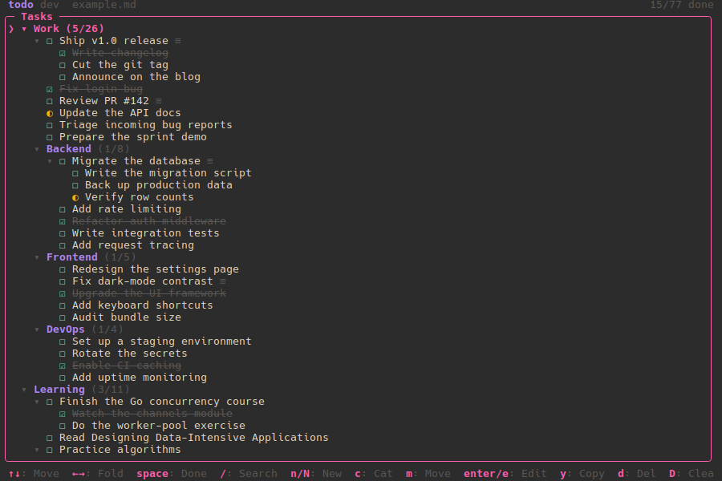

# todo

A minimalistic, keyboard-driven TODO manager for the terminal. It opens a plain
markdown file as a task list — headers are categories, `- [ ]` items are tasks,
and nested items are subtasks. Everything you do is written straight back to the
file, so your todos stay readable, greppable, and git-friendly.

Built with the [Charm](https://charm.sh) stack: [Bubble Tea](https://github.com/charmbracelet/bubbletea),
[Bubbles](https://github.com/charmbracelet/bubbles), and [Lipgloss](https://github.com/charmbracelet/lipgloss),
with [Cobra](https://github.com/spf13/cobra) for the CLI.



## Install

todo is a single, dependency-free binary (pure Go, no CGO). Prebuilt archives, a
Debian package, and a macOS cask are published on every tagged release.

### macOS (Homebrew)

A macOS cask is published to the
[candy-tools/homebrew-tap](https://github.com/candy-tools/homebrew-tap) tap on
every tagged release. Add the tap, then install:

```bash
brew tap candy-tools/tap
brew install --cask todo
```

`brew upgrade` tracks future releases. The binary isn't notarized, so the cask
strips the Gatekeeper quarantine flag on install — no "todo is damaged" prompt.

### Debian / Ubuntu

Download the `.deb` for your architecture from the
[releases page](https://github.com/candy-tools/todo/releases) and install it:

```bash
sudo apt install ./todo_*_amd64.deb
```

### From source

With a Go 1.26+ toolchain installed:

```bash
go install github.com/candy-tools/todo@latest
```

Or grab a prebuilt `tar.gz` (`.zip` on Windows) for your OS/arch from the
[releases page](https://github.com/candy-tools/todo/releases).

## Documentation

Usage — the task tree, every key, the search filter, live reload, and the
markdown file format — is documented in
**[DOCUMENTATION.md](DOCUMENTATION.md)**.

## Develop

Requires Go 1.26+. The full toolchain also needs `golangci-lint`, `goreleaser`,
and `go-licence-detector`. todo has no runtime dependencies — it's a single
static binary.

```bash
make help         # list all targets
make test         # run tests with coverage
make lint         # golangci-lint
make vet          # go vet
make coverage     # enforce the per-package coverage threshold
```

### Run

```bash
make run          # runs against example.md
# or plain go:
go run . path/to/file.md
```

### Build

```bash
make build        # goreleaser snapshot build for the current OS/arch → ./dist
# or plain go:
go build ./...
```

### Release

Releases are published by pushing a semver tag from a clean `main` branch. The
tag triggers the [Release workflow](./.github/workflows/release.yml), which runs
GoReleaser to build and publish the archives, `.deb`, and Homebrew cask.

```bash
make tag version="v1.2.3"
```

`make tag` refuses to run unless you're on `main` with a clean working tree, then
creates and pushes the `vX.Y.Z` tag.
